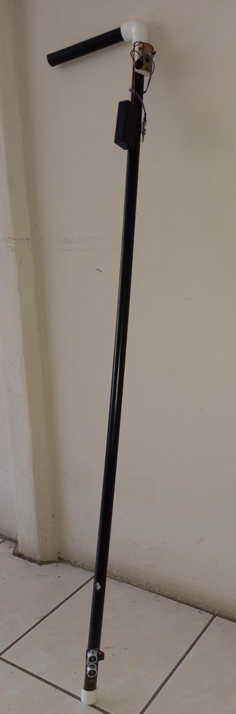

<!-- Improved compatibility of back to top link: See: https://github.com/fabbileon23/SystemsUISIL-Expocenfo -->

<!--

<!-- PROJECT LOGO -->
 

  

<h1 align="center"> Expocenfo 2024</h1> 

<h1 align="center">Bastón Inteligente para Personas No Videntes y Casa Domotica</h1>
 

<!-- TABLE OF CONTENTS -->

  
Table of Contents

  <ol>
    <li>
      <a href="#Descripcion-del-Proyecto">Descripcion del Proyecto</a>
      <ul>
        <li><a href="#Caracteristicas-del-Proyecto.">Caracteristicas</a></li>
      </ul>
    </li>
    <li>
      <a href="#getting-started">Getting Started</a>
      <ul>
        <li><a href="#prerequisites">Prerequisites</a></li>
        <li><a href="#installation">Installation</a></li>
      </ul>
    </li>
    <li><a href="#usage">Usage</a></li>
    <li><a href="#roadmap">Roadmap</a></li>
    <li><a href="#contributing">Contributing</a></li>
    <li><a href="#license">License</a></li>
    <li><a href="#contact">Contact</a></li>
    <li><a href="#acknowledgments">Acknowledgments</a></li>
  </ol>

<!-- ABOUT THE PROJECT -->
## Descripcion del Proyecto
Este proyecto está enfocado en mejorar la calidad de vida de las personas no videntes, proporcionando herramientas que les permitan moverse y vivir de manera más independiente y segura. El proyecto incluye dos componentes principales:

* Bastón Inteligente: Un dispositivo diseñado para ayudar a las personas a navegar su entorno de manera segura, utilizando sensores que detectan obstáculos, y alertan al usuario mediante vibraciones y sonidos.
 

    

 

* Casa Domótica: Un sistema de hogar inteligente que incluye tecnologías como RFID para acceso seguro, sensores que monitorean la calidad del aire y las condiciones de temperatura, y un sistema de iluminación automática.
 

    

 

(<a href="#readme-top">back to top</a>)

## Caracteristicas del Proyecto.
### Bastón Inteligente
* Sensores de Proximidad:
Utiliza sensores ultrasónicos para medir la distancia entre el bastón y los objetos cercanos.
Cuando un objeto es detectado dentro de un rango específico, el bastón alerta al usuario.

* Vibración:
El mango del bastón tiene un motor vibratorio que se activa cuando se detecta un obstáculo.
La intensidad de la vibración puede variar dependiendo de la distancia del obstáculo, proporcionando una retroalimentación táctil intuitiva.

* Sonido:
Se emiten alertas sonoras cuando se detecta un obstáculo, proporcionando una segunda capa de información al usuario.
Los sonidos pueden personalizarse para diferenciar entre tipos de obstáculos o distancias.

### Casa Domotica
* RFID (Identificación por Radiofrecuencia):
Utilizado para acceder de manera segura al hogar sin necesidad de llaves.
Cada usuario tiene una tarjeta RFID personalizada que, al ser escaneada, desbloquea la puerta.

* Sensores de Humedad y Temperatura:
Monitorean las condiciones ambientales dentro del hogar.
Permiten ajustar automáticamente el sistema de calefacción o aire acondicionado para mantener un ambiente confortable.

* Iluminación Automática:
Basada en la detección de presencia y las condiciones de luz ambiental, las luces se encienden y apagan automáticamente.
Esto asegura que las luces siempre estén encendidas cuando sea necesario y ahorra energía cuando no lo es.

